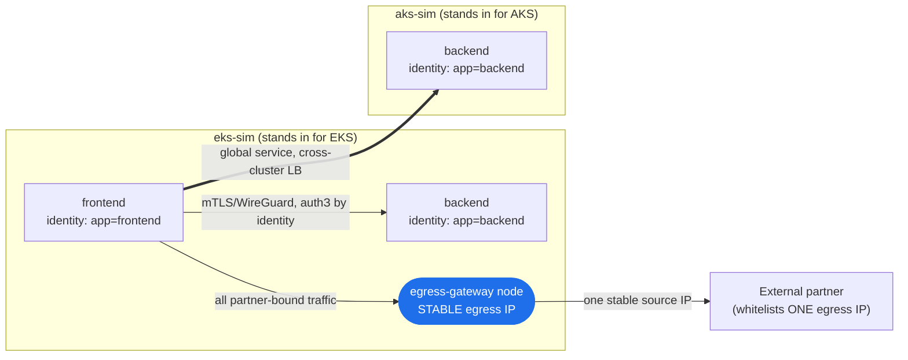
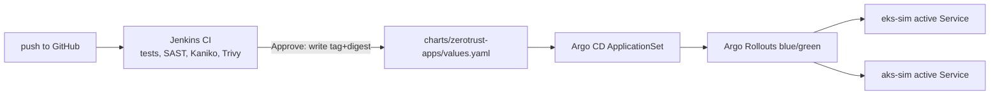

# Multi-cluster zero-trust networking on your Mac — identity, not IP

> **The problem, in one line:** cross-cluster services stop talking to each other
> every time a cluster upgrade rotates node/LB IPs, and security won't let you
> whitelist CIDR ranges. **The fix:** stop authorizing by IP. Authorize by
> cryptographic workload identity, and pin *outbound* traffic to one stable
> egress IP.

This repo spins up **two Kubernetes clusters on a single Mac** (Apple Silicon or
Intel) that stand in for **EKS** and **AKS**, connects them with **Cilium
Cluster Mesh**, and proves three things security actually cares about — with no
cloud bill.

---

## The scenario

You run services across several clusters (local + EKS + AKS). Each service sits
behind its own load balancer. Then:

- A cluster upgrade / node rotation / autoscale event happens → **every node and
  LB IP changes**.
- Your cross-service allowlists were written against those IPs → **traffic
  breaks**.
- You ask security to whitelist a CIDR range so it stops breaking → **denied**,
  because a `/16` allow rule is the opposite of least privilege.

You're stuck between *ephemeral IPs* and *no CIDR whitelisting*. The way out is
to **stop making IP the unit of trust.**

## The architecture



Three mechanisms, each mapping to a requirement:

| Requirement | Mechanism | Why it survives cluster upgrades |
|---|---|---|
| Services find each other across clusters | **Cluster Mesh global service** (`service.cilium.io/global: "true"`) | Discovery is by service identity, not endpoint IP |
| No CIDR whitelisting for east-west | **`CiliumNetworkPolicy` on labels/identity** + **WireGuard mTLS** | Rule says *who* (`app=frontend`), never *where* |
| The one place a stable IP is needed | **`CiliumEgressGatewayPolicy`** → dedicated node with a pinned IP | Security whitelists 1 IP; it doesn't move on upgrade |

> Everyone reaches for Istio here. Cilium is the sharper tool for *this* problem:
> the egress-gateway (stable egress IP) and identity policy are native eBPF
> features in the datapath — no sidecars — and it's the same stack you can run on
> EKS (Cilium ENI) and AKS (*Azure CNI powered by Cilium*, GA).

---

## Run it

Requires: Docker Desktop running, `kind`, `kubectl`, `helm`, Homebrew. The first
script installs the `cilium` CLI for you.

```bash
make up      # prereqs -> 2 clusters -> Cilium -> Cluster Mesh -> apps + policy
make gitops  # Jenkins (CI) + Argo CD (Helm CD from GitHub) on eks-sim
make test    # runs the 3 proofs below
make hubble  # optional: live traffic-map UI for screenshots
make down    # tear everything down
```

Or step by step: `scripts/00…05` in order, then `06-install-gitops.sh` (`99-teardown.sh` to clean up).

### GitOps flow (Jenkins + Helm + Argo CD + Argo Rollouts)



- **Git** is the source of truth (`backend.image.tag` + `digest`).
- **Jenkins** builds and scans. After **Approve** it commits the image pin. It must not `kubectl apply`, `helm upgrade`, or patch Services.
- **SAST:** Semgrep always runs. SonarQube scanner uploads to `sonarqube` on `eks-sim` (NodePort `30090`) when the server is UP; otherwise that branch is skipped.
- **Trivy:** filesystem scan of `app/` in Security, then **image** scan after Kaniko (CRITICAL fails the build).
- **Argo CD** renders `charts/zerotrust-apps` onto both clusters.
- **Argo Rollouts** creates Green beside Blue, smokes the Preview Service, then switches `zerotrust-backend-active`. See [gitops/BLUE-GREEN.md](gitops/BLUE-GREEN.md).
- **UIs:** Jenkins NodePort `30081` (`admin` / `admin123`), Argo CD `30080`.

Frontend always calls **`zerotrust-backend-active`**, never a ReplicaSet or preview Service.

### What `make test` proves

1. **Cross-cluster global service** — `curl backend.apps.svc` from `eks-sim`
   returns responses from backends in **both** clusters. One service name, two
   clusters, zero IPs pinned.
2. **Identity-based authorization** — `frontend` (identity `app=frontend`) is
   allowed; `bad-client` on the same network (identity `app=bad-client`) is
   **dropped**. No IP or CIDR appears anywhere in the policy.
3. **Stable egress IP** — an external "partner" container sees **the same source
   IP** for every request, regardless of which node the pod runs on. That's the
   single IP your security team whitelists.

---

## Sharing a CA (why the mesh connect uses `--allow-mismatching-ca`)

Each cluster is provisioned with its **own** Cilium CA — which is exactly what
you get when EKS and AKS are created independently. `cilium clustermesh connect`
therefore uses `--allow-mismatching-ca`, which **bundles** the remote CA into the
trust store rather than demanding a single shared CA. This is a legitimate,
supported multi-cloud pattern.

For a greenfield fleet you can instead install every cluster from **one shared
CA**: create the `cilium-ca` secret once and apply it to all clusters *before*
installing Cilium, then drop the flag. Shared-CA is tidier; bundle-CA is what you
reach for when the clusters already exist in different clouds.

## How this maps to real EKS + AKS

The manifests are identical across environments. Only the platform plumbing
differs:

| Concern | Local (this repo) | EKS | AKS |
|---|---|---|---|
| CNI | Cilium on kind | Cilium (ENI/overlay) | *Azure CNI powered by Cilium* (GA) |
| `LoadBalancer` svc | Cilium LB-IPAM / kind | AWS LB Controller (NLB) | Azure LB |
| Cross-cluster reachability | shared docker net | VPC peering / TGW, or public east-west + mTLS | VNet peering, or public + mTLS |
| **Stable egress IP** | egress-gateway node IP | **Elastic IP** on the egress node/NAT | **static Public IP / NAT Gateway** |
| Encryption in transit | WireGuard | WireGuard | WireGuard |

Same `CiliumNetworkPolicy`, same global-service annotation, same egress policy —
you change annotations on the LoadBalancer and attach a cloud static IP, nothing
in the security model changes.

---

## Gotchas that bite everyone (and what they teach)

Two things break for almost everyone doing this the first time. Both are in the
scripts already — called out here because they're the interview-grade details.

**1. Independent clusters have independent CAs.** EKS and AKS created separately
don't share a Cilium CA, so `cilium clustermesh connect` refuses to join them.
Fix: `--allow-mismatching-ca` bundles the remote CA into the trust store (or
share a CA up front — see above). *Lesson: trust between clusters is a deliberate
step, not a default.*

**2. Cross-cluster identity is default-deny — on purpose.** A `CiliumNetworkPolicy`
`fromEndpoints: {app: frontend}` silently gets scoped to the **local** cluster:
Cilium appends `io.cilium.k8s.policy.cluster: <local>` to the selector. So the
policy applied in AKS did *not* match the `frontend` running in EKS, and every
cross-cluster request was dropped — `Policy denied ... match none` in
`cilium monitor`, even though routing and service discovery were perfect. Fix:
name the source cluster explicitly in `fromEndpoints`
(`io.cilium.k8s.policy.cluster: eks-sim`). *Lesson: the mesh will not let a local
rule silently authorize a look-alike identity from another cluster — you opt in
per cluster. That's the zero-trust model working as intended.*

How to see #2 yourself:
```bash
# which identities does the policy selector actually match on aks-sim?
kubectl --context kind-aks-sim -n kube-system exec ds/cilium -c cilium-agent -- \
  cilium-dbg policy selectors list
# watch the drop live while curling cross-cluster:
kubectl --context kind-aks-sim -n kube-system exec ds/cilium -c cilium-agent -- \
  cilium-dbg monitor --type drop
```

## Cleanup

```bash
make down    # deletes both kind clusters and the partner container
```
